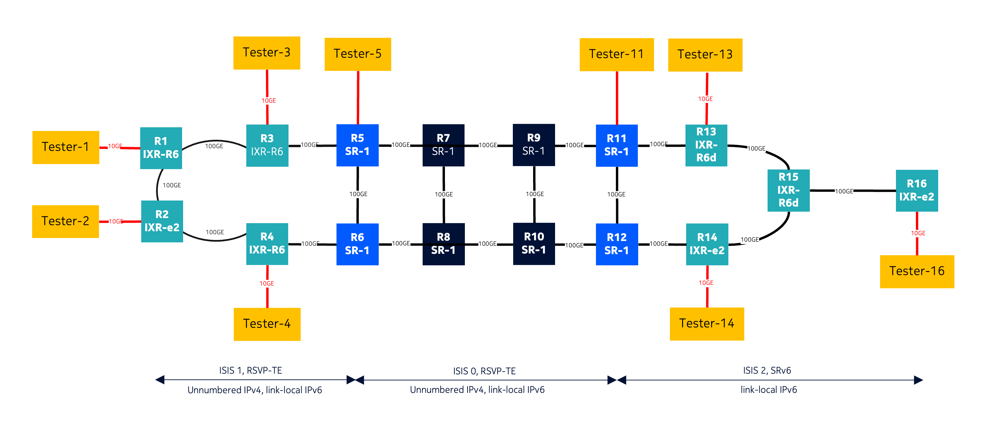
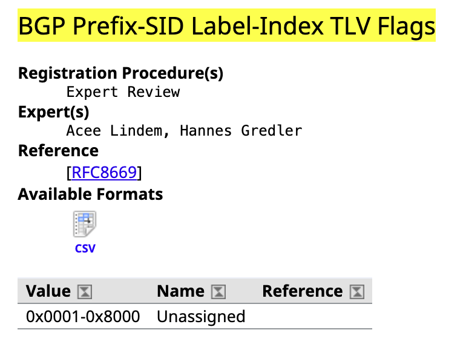
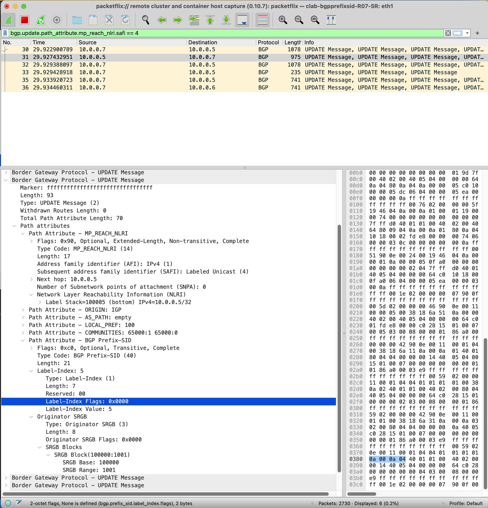
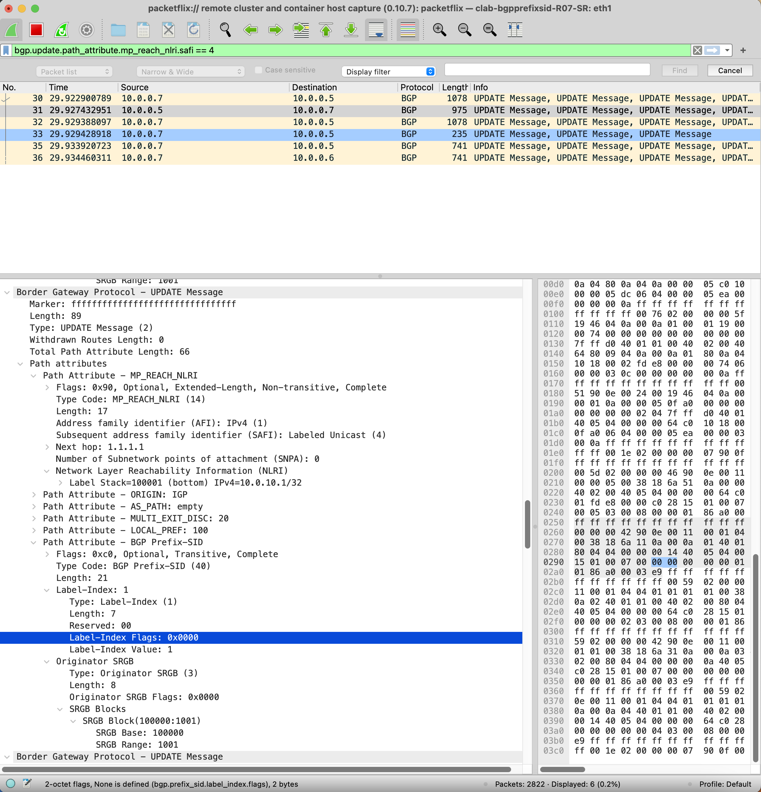

# BGP Prefix SID Flags

## 1. Objective

Identify the Flag values sent via BGP Prefix SID from an SROS-based node. The goal is to validate what Label-Index TLV Flags are being sent.

## 2. Lab Setup

Reusing Lab topology, we will analyze BGP-LU with Prefix SID sent by R5 (ABR) to R7 (RR).



### 2.1 Configuration
BGP sessions
- Core (10.0.0.7): export BGP-LU including Prefix-SID using IP Anycast as Next-Hop IP (1.1.1.1). Reuses IGP SR-ISIS labels from access ISIS instance.
- Access (10.0.10.1): export BGP EVPN, VPNv4 and VPNv6 changing Next-Hop for the IP Anycast address (3.3.3.3).

```cpp
(gl)[/configure router "Base" bgp]
A:admin@R05_SR-1# info flat 
    admin-state enable
    advertise-inactive true
    rapid-withdrawal true
    rapid-update vpn-ipv4 true
    rapid-update vpn-ipv6 true
    rapid-update evpn true
    next-hop-resolution labeled-routes transport-tunnel family label-ipv4 resolution any
    rib-management label-ipv4 route-table-import policy-name "export-access-1"
    segment-routing admin-state enable
    segment-routing prefix-sid-range global
    group "access" vpn-apply-export true
    group "access" next-hop-self true
    group "access" peer-as 65000
    group "access" family vpn-ipv4 true
    group "access" family vpn-ipv6 true
    group "access" family evpn true
    group "access" cluster cluster-id 10.0.0.5
    group "access" export policy ["evpn-NH"]
    group "core" next-hop-self true
    group "core" peer-as 65000
    group "core" family vpn-ipv4 true
    group "core" family vpn-ipv6 true
    group "core" family evpn true
    group "core" family label-ipv4 true
    group "core" export policy ["export-label-system" "change-NH" "export-access-1"]
    neighbor "10.0.0.7" group "core"
    neighbor "10.0.10.1" group "access"
    neighbor "10.0.10.2" group "access"
    neighbor "10.0.10.3" group "access"
    neighbor "10.0.10.4" group "access"
```

```cpp
(gl)[/configure policy-options]
A:admin@R05_SR-1# info flat
    community "access-1" { member "65000:1" }
    community "access-2" { member "65000:2" }
    community "core" { member "65000:0" }
    prefix-list "access-1" { prefix 10.0.10.0/24 type longer }
    prefix-list "access-2" { prefix 10.0.20.0/24 type longer }
    prefix-list "if-system" { prefix 10.0.0.5/32 type exact }
    prefix-list "routers-system-ip" { prefix 10.0.0.0/16 type longer }
    policy-statement "change-NH" entry 10 from family [label-ipv4]
    policy-statement "change-NH" entry 10 from protocol name [bgp-label]
    policy-statement "change-NH" entry 10 action action-type accept
    policy-statement "change-NH" entry 10 action next-hop 1.1.1.1
    policy-statement "evpn-NH" entry 10 from protocol name [bgp-vpn]
    policy-statement "evpn-NH" entry 10 action action-type accept
    policy-statement "evpn-NH" entry 10 action next-hop 3.3.3.3
    policy-statement "export-access-1" entry 10 from prefix-list ["access-1"]
    policy-statement "export-access-1" entry 10 from protocol name [isis]
    policy-statement "export-access-1" entry 10 from protocol instance 1
    policy-statement "export-access-1" entry 10 action action-type accept
    policy-statement "export-access-1" entry 10 action next-hop 1.1.1.1
    policy-statement "export-access-1" entry 10 action sr-label-index value 51
    policy-statement "export-access-1" entry 10 action sr-label-index prefer-igp true
    policy-statement "export-from-core" entry 10 from prefix-list ["access-2"]
    policy-statement "export-from-core" entry 10 from protocol name [bgp-label]
    policy-statement "export-from-core" entry 10 to protocol name [isis]
    policy-statement "export-from-core" entry 10 to protocol instance 1
    policy-statement "export-from-core" entry 10 action action-type accept
    policy-statement "export-label-system" entry 10 from prefix-list ["if-system"]
    policy-statement "export-label-system" entry 10 from protocol name [direct]
    policy-statement "export-label-system" entry 10 action action-type accept
    policy-statement "export-label-system" entry 10 action community add ["access-1" "core"]
    policy-statement "routers-system" entry 10 from prefix-list ["routers-system-ip"]
    policy-statement "routers-system" entry 10 action action-type accept
```

ISIS instance for access
```
(gl)[/configure router "Base" isis 1]
A:admin@R05_SR-1# info flat 
    admin-state enable
    advertise-router-capability as
    ipv6-routing mt
    level-capability 1
    standard-multi-instance true
    traffic-engineering true
    area-address [49.1011.1111.11]
    multi-topology ipv6-unicast true
    traffic-engineering-options application-link-attributes legacy false
    segment-routing admin-state enable
    segment-routing prefix-sid-range global
    interface "BGPAnycast-Access" passive true
    interface "BGPAnycast-Access" ipv4-node-sid index 300
    interface "system" interface-type point-to-point
    interface "toR03" interface-type point-to-point
    interface "toR06" interface-type point-to-point
    level 1 wide-metrics-only true
```

### 2.2 Outputs

```cpp
A:admin@R05_SR-1# /show router bgp summary 
===============================================================================
 BGP Router ID:10.0.0.5         AS:65000       Local AS:65000      
===============================================================================
BGP Admin State         : Up          BGP Oper State              : Up
Total Peer Groups       : 2           Total Peers                 : 5         
Total VPN Peer Groups   : 0           Total VPN Peers             : 0         
Current Internal Groups : 2           Max Internal Groups         : 2         
Total BGP Paths         : 57          Total Path Memory           : 21984     
 
Total IPv4 Remote Rts   : 0           Total IPv4 Rem. Active Rts  : 0         
Total IPv6 Remote Rts   : 0           Total IPv6 Rem. Active Rts  : 0         
Total IPv4 Backup Rts   : 0           Total IPv6 Backup Rts       : 0         
Total LblIpv4 Rem Rts   : 16          Total LblIpv4 Rem. Act Rts  : 4         
Total LblIpv6 Rem Rts   : 0           Total LblIpv6 Rem. Act Rts  : 0         
Total LblIpv4 Bkp Rts   : 0           Total LblIpv6 Bkp Rts       : 0          
Total Supressed Rts     : 0           Total Hist. Rts             : 0         
Total Decay Rts         : 0         
 
Total VPN-IPv4 Rem. Rts : 0           Total VPN-IPv4 Rem. Act. Rts: 0         
Total VPN-IPv6 Rem. Rts : 0           Total VPN-IPv6 Rem. Act. Rts: 0         
Total VPN-IPv4 Bkup Rts : 0           Total VPN-IPv6 Bkup Rts     : 0         
Total VPN Local Rts     : 1           Total VPN Supp. Rts         : 0         
Total VPN Hist. Rts     : 0           Total VPN Decay Rts         : 0         
 
Total MVPN-IPv4 Rem Rts : 0           Total MVPN-IPv4 Rem Act Rts : 0         
Total MVPN-IPv6 Rem Rts : 0           Total MVPN-IPv6 Rem Act Rts : 0         
Total MDT-SAFI Rem Rts  : 0           Total MDT-SAFI Rem Act Rts  : 0         
Total McIPv4 Remote Rts : 0           Total McIPv4 Rem. Active Rts: 0         
Total McIPv6 Remote Rts : 0           Total McIPv6 Rem. Active Rts: 0         
Total McVpnIPv4 Rem Rts : 0           Total McVpnIPv4 Rem Act Rts : 0         
Total McVpnIPv6 Rem Rts : 0           Total McVpnIPv6 Rem Act Rts : 0         
 
Total EVPN Rem Rts      : 8           Total EVPN Rem Act Rts      : 1         
Total L2-VPN Rem. Rts   : 0           Total L2VPN Rem. Act. Rts   : 0         
Total MSPW Rem Rts      : 0           Total MSPW Rem Act Rts      : 0         
Total RouteTgt Rem Rts  : 0           Total RouteTgt Rem Act Rts  : 0         
Total FlowIpv4 Rem Rts  : 0           Total FlowIpv4 Rem Act Rts  : 0         
Total FlowIpv6 Rem Rts  : 0           Total FlowIpv6 Rem Act Rts  : 0         
Total FlowVpnv4 Rem Rts : 0           Total FlowVpnv4 Rem Act Rts : 0         
Total FlowVpnv6 Rem Rts : 0           Total FlowVpnv6 Rem Act Rts : 0         
Total Link State Rem Rts: 0           Total Link State Rem Act Rts: 0         
Total SrPlcyIpv4 Rem Rts: 0           Total SrPlcyIpv4 Rem Act Rts: 0         
Total SrPlcyIpv6 Rem Rts: 0           Total SrPlcyIpv6 Rem Act Rts: 0         

===============================================================================
BGP Summary
===============================================================================
Legend : D - Dynamic Neighbor
===============================================================================
Neighbor
Description
                   AS PktRcvd InQ  Up/Down   State|Rcv/Act/Sent (Addr Family)
                      PktSent OutQ
-------------------------------------------------------------------------------
10.0.0.7
                65000     157    0 00h58m28s 0/0/0 (VpnIPv4)
                          131    0           0/0/0 (VpnIPv6)
                                             6/1/3 (Evpn)
                                             16/4/5 (Lbl-IPv4)
10.0.10.1
                65000     123    0 00h58m06s 0/0/0 (VpnIPv4)
                          131    0           0/0/0 (VpnIPv6)
                                             1/0/6 (Evpn)
10.0.10.2
                65000     122    0 00h58m08s 0/0/0 (VpnIPv4)
                          131    0           0/0/0 (VpnIPv6)
                                             0/0/6 (Evpn)
10.0.10.3
                65000     123    0 00h58m31s 0/0/0 (VpnIPv4)
                          132    0           0/0/0 (VpnIPv6)
                                             0/0/6 (Evpn)
10.0.10.4
                65000     123    0 00h58m14s 0/0/0 (VpnIPv4)
                          131    0           0/0/0 (VpnIPv6)
                                             1/0/6 (Evpn)
-------------------------------------------------------------------------------
```

```cpp
A:admin@R05_SR-1# /show router bgp neighbor "10.0.0.7" advertised-routes label-ipv4
===============================================================================
 BGP Router ID:10.0.0.5         AS:65000       Local AS:65000      
===============================================================================
 Legend -
 Status codes  : u - used, s - suppressed, h - history, d - decayed, * - valid
                 l - leaked, x - stale, > - best, b - backup, p - purge
 Origin codes  : i - IGP, e - EGP, ? - incomplete

===============================================================================
BGP LABEL-IPV4 Routes
===============================================================================
Flag  Network                                            LocalPref   MED
      Nexthop (Router)                                   Path-Id     IGP Cost
      As-Path                                                        Label
-------------------------------------------------------------------------------
i     10.0.0.5/32                                        100         None
      10.0.0.5                                           None        n/a
      No As-Path                                                     100005
i     10.0.10.1/32                                       100         20
      1.1.1.1                                            None        n/a
      No As-Path                                                     100001
i     10.0.10.2/32                                       100         30
      1.1.1.1                                            None        n/a
      No As-Path                                                     100002
i     10.0.10.3/32                                       100         10
      1.1.1.1                                            None        n/a
      No As-Path                                                     100003
i     10.0.10.4/32                                       100         20
      1.1.1.1                                            None        n/a
      No As-Path                                                     100004
-------------------------------------------------------------------------------
Routes : 5
===============================================================================
```

```cpp
A:admin@R05_SR-1# /show router bgp routes 10.0.0.5/32 label-ipv4 hunt
===============================================================================
 BGP Router ID:10.0.0.5         AS:65000       Local AS:65000      
===============================================================================
 Legend -
 Status codes  : u - used, s - suppressed, h - history, d - decayed, * - valid
                 l - leaked, x - stale, > - best, b - backup, p - purge
 Origin codes  : i - IGP, e - EGP, ? - incomplete

===============================================================================
BGP LABEL-IPV4 Routes
===============================================================================
-------------------------------------------------------------------------------
RIB In Entries
-------------------------------------------------------------------------------
Network        : 10.0.0.5/32
Nexthop        : 10.0.0.5
Path Id        : None                   
From           : 10.0.0.7
Res. Nexthop   : Unresolved
Local Pref.    : 100                    Interface Name : NotAvailable
Aggregator AS  : None                   Aggregator     : None
Atomic Aggr.   : Not Atomic             MED            : None
AIGP Metric    : None                   IGP Cost       : 0
Connector      : None
Community      : 65000:1 65000:0
Cluster        : 10.0.0.7
Originator Id  : 10.0.0.5               Peer Router Id : 10.0.0.7
Fwd Class      : None                   Priority       : None
IPv4 Label     : 100005                 
Origin         : IGP                    
Flags          : Invalid Nexthop-Unresolved 
Route Source   : Internal
AS-Path        : No As-Path
Route Tag      : 0                      
Neighbor-AS    : n/a
DB Orig Val    : NotFound               Final Orig Val : NotFound
Source Class   : 0                      Dest Class     : 0
Add Paths Send : Default                
RIB Priority   : Normal                 
Last Modified  : 01h02m28s              
Prefix SID     : index 5, originator-srgb [100000/1001]
 
-------------------------------------------------------------------------------
RIB Out Entries
-------------------------------------------------------------------------------
Network        : 10.0.0.5/32
Nexthop        : 10.0.0.5
Path Id        : None                   
To             : 10.0.0.7
Res. Nexthop   : n/a
Local Pref.    : 100                    Interface Name : NotAvailable
Aggregator AS  : None                   Aggregator     : None
Atomic Aggr.   : Not Atomic             MED            : None
AIGP Metric    : None                   IGP Cost       : n/a
Connector      : None
Community      : 65000:1 65000:0
Cluster        : No Cluster Members
Originator Id  : None                   Peer Router Id : 10.0.0.7
IPv4 Label     : 100005                 Label Type     : SR_POP
Lbl Allocation : PER-PREFIX             
Origin         : IGP                    
AS-Path        : No As-Path
Route Tag      : 0                      
Neighbor-AS    : n/a
DB Orig Val    : N/A                    Final Orig Val : N/A
Source Class   : 0                      Dest Class     : 0
Prefix SID     : index 5, originator-srgb [100000/1001]
 
-------------------------------------------------------------------------------
Routes : 2
===============================================================================
```

```cpp
A:admin@R07_SR-1# /show router bgp routes 10.0.0.5/32 label-ipv4 detail             
===============================================================================
 BGP Router ID:10.0.0.7         AS:65000       Local AS:65000      
===============================================================================
 Legend -
 Status codes  : u - used, s - suppressed, h - history, d - decayed, * - valid
                 l - leaked, x - stale, > - best, b - backup, p - purge
 Origin codes  : i - IGP, e - EGP, ? - incomplete

===============================================================================
BGP LABEL-IPV4 Routes
===============================================================================
Original Attributes
 
Network        : 10.0.0.5/32
Nexthop        : 10.0.0.5
Path Id        : None                   
From           : 10.0.0.5
Res. Nexthop   : 10.0.0.5 (ISIS Tunnel)
Local Pref.    : 100                    Interface Name : NotAvailable
Aggregator AS  : None                   Aggregator     : None
Atomic Aggr.   : Not Atomic             MED            : None
AIGP Metric    : None                   IGP Cost       : 10
Connector      : None
Community      : 65000:1 65000:0
Cluster        : No Cluster Members
Originator Id  : None                   Peer Router Id : 10.0.0.5
Fwd Class      : None                   Priority       : None
IPv4 Label     : 100005                 
Origin         : IGP                    
Flags          : Valid 
TieBreakReason : RtmPref                
Route Source   : Internal
AS-Path        : No As-Path
Route Tag      : 0                      
Neighbor-AS    : n/a
DB Orig Val    : NotFound               Final Orig Val : N/A
Source Class   : 0                      Dest Class     : 0
Add Paths Send : Default                
RIB Priority   : Normal                 
Last Modified  : 00h12m07s              
Prefix SID     : index 5, originator-srgb [100000/1001]
 
Modified Attributes
 
Network        : 10.0.0.5/32
Nexthop        : 10.0.0.5
Path Id        : None                   
From           : 10.0.0.5
Res. Nexthop   : 10.0.0.5 (ISIS Tunnel)
Local Pref.    : 100                    Interface Name : NotAvailable
Aggregator AS  : None                   Aggregator     : None
Atomic Aggr.   : Not Atomic             MED            : None
AIGP Metric    : None                   IGP Cost       : 10
Connector      : None
Community      : 65000:1 65000:0
Cluster        : No Cluster Members
Originator Id  : None                   Peer Router Id : 10.0.0.5
Fwd Class      : None                   Priority       : None
IPv4 Label     : 100005                 
Origin         : IGP                    
Flags          : Valid 
TieBreakReason : RtmPref                
Route Source   : Internal
AS-Path        : No As-Path
Route Tag      : 0                      
Neighbor-AS    : n/a
DB Orig Val    : NotFound               Final Orig Val : NotFound
Source Class   : 0                      Dest Class     : 0
Add Paths Send : Default                
RIB Priority   : Normal                 
Last Modified  : 00h12m07s              
Prefix SID     : index 5, originator-srgb [100000/1001]
 
-------------------------------------------------------------------------------
-------------------------------------------------------------------------------
Routes : 1
===============================================================================
```

### 2.3 Findings

According to [RFC 8669](https://datatracker.ietf.org/doc/rfc8669/), Flags for Label-Index TLV in BGP Segment Routing extension have not been defined.

```
3.1.  Label-Index TLV

   The Label-Index TLV MUST be present in the BGP Prefix-SID attribute
   attached to IPv4/IPv6 Labeled Unicast prefixes ([RFC8277]).  It MUST
   be ignored when received for other BGP AFI/SAFI combinations.  The
   Label-Index TLV has the following format:

    0                   1                   2                   3
    0 1 2 3 4 5 6 7 8 9 0 1 2 3 4 5 6 7 8 9 0 1 2 3 4 5 6 7 8 9 0 1
   +-+-+-+-+-+-+-+-+-+-+-+-+-+-+-+-+-+-+-+-+-+-+-+-+-+-+-+-+-+-+-+-+
   |       Type    |             Length            |   RESERVED    |
   +-+-+-+-+-+-+-+-+-+-+-+-+-+-+-+-+-+-+-+-+-+-+-+-+-+-+-+-+-+-+-+-+
   |            Flags              |       Label Index             |
   +-+-+-+-+-+-+-+-+-+-+-+-+-+-+-+-+-+-+-+-+-+-+-+-+-+-+-+-+-+-+-+-+
   |          Label Index          |
   +-+-+-+-+-+-+-+-+-+-+-+-+-+-+-+-+

   where:

      Type:  1

      Length:  7, the total length in octets of the value portion of the
         TLV.

      RESERVED:  8-bit field.  It MUST be clear on transmission and MUST
         be ignored on reception.

      Flags:  16 bits of flags.  None are defined by this document.  The
         Flags field MUST be clear on transmission and MUST be ignored
         on reception.

      Label Index:  32-bit value representing the index value in the
         SRGB space.

```

IANA BGP Prefix-SID Label-Index TLV Flags have not been assined. [IANA site](https://www.iana.org/assignments/bgp-parameters/bgp-parameters.xhtml#bgp-prefix-sid-label-index-tlv-flags)



Based on this, BGP update received at 10.0.0.7 from 10.0.0.5 does not contain any Flag.



Similarly, when R5 (10.0.0.5) exports and IGP SR-ISIS Prefix-SID from access like R1 (10.0.10.1/32) via BGP-LU to R7 (10.0.0.7), no flags are set.

